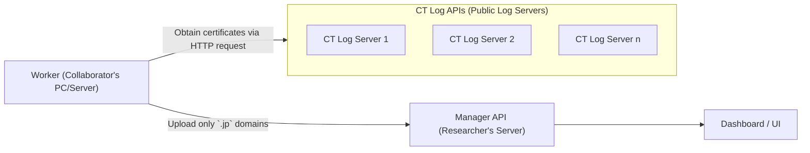
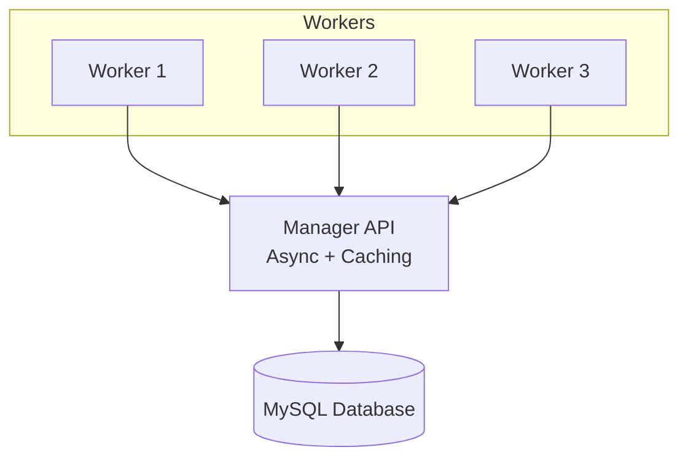
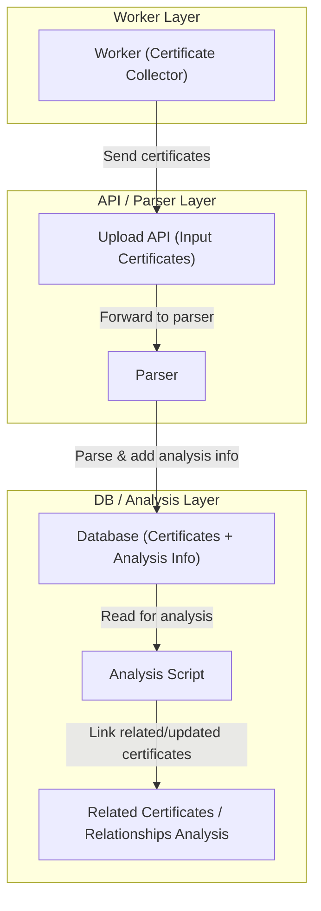
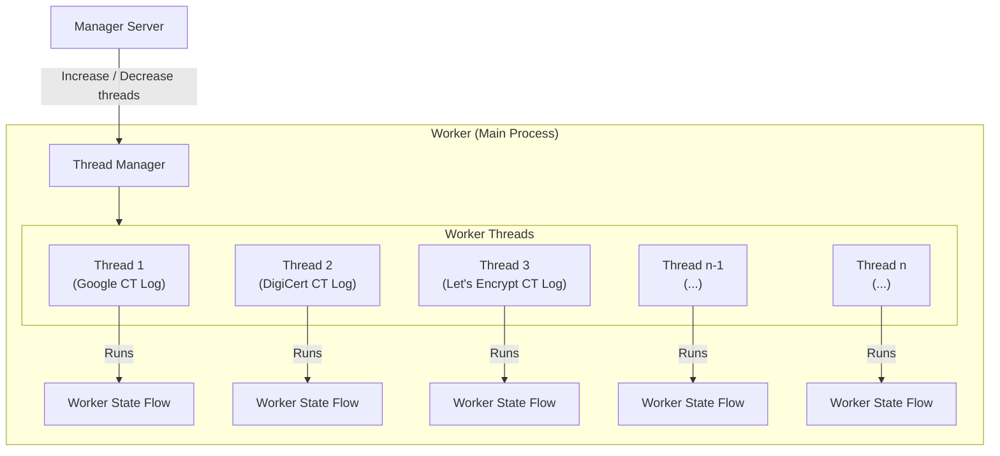
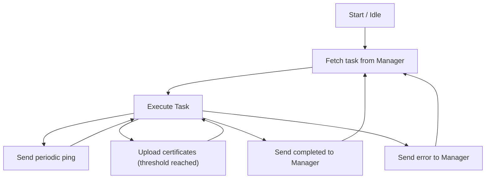

# CT Log Distributed Collection System - Main README

This repository is a system for distributed collection and visualization of Certificate Transparency logs. **It corrects only the .jp domain certificates.**

- `src/manager_api/` ... Collection management API (FastAPI, MySQL)
- `src/ui/`  ... Collection status visualization UI (FastAPI + Jinja2)
- `src/worker/`      ... Collection script for each worker node
- `src/share/`       ... Shared logic and parsers

## Overview






Worker Multi-Thread / Multi-Log Overview


Worker State Flow

---

## Setup Steps (General Overview)

1. Start the MySQL server and create the `ct` database
2. **Configure database connection**: Copy `src/config_secret.py.example` to `src/config_secret.py` and configure your MySQL connection URL
3. Start manager_api (API server)
4. Start ui (UI server)
5. Start `worker.py` on each worker node

---

## Reference
- Please refer to each directory's `README.md`
- Docker Compose and command examples are also described in each README

## How to run
### Python
```sh
PYTHONPATH=. python src/manager_api/debug.py
PYTHONPATH=. python src/ui/debug.py
PYTHONPATH=. python src/worker/worker.py
---

Note: Only Python 3.11 works. Some libraries for Python 3.12+ are not supported yet.

```
### Docker Compose
```sh
sudo docker compose up
```

### Docker run
```sh
sudo docker run -d --name ct-log-manager -p 1173:1173 \
    docker.io/kujiy/ct-api
sudo docker run -d --name ct-log-ui -p 1174:1174 \
    --link ct-log-manager:manager-api \
    docker.io/kujiy/ct-ui
sudo docker run -d --name ct-log-worker --restart unless-stopped \
    --link ct-log-manager:manager-api \
    docker.io/kujiy/ct-worker
```

# Worker Users README
Helping with this research is easy.

## If you can use Docker
```shell
$ sudo docker run -d --name ct-log-worker --restart always docker.io/kujiy/ct-worker:20250929-213931
```
If you give the worker a name, your name will be published on the Dashboard.

```shell
MY_NAME=your-public-name
sudo docker run -d --name ct-log-worker --restart always -e WORKER_NAME=$MY_NAME docker.io/kujiy/ct-worker:20250929-213931
```

## If you want to run on Kubernetes (k8s)
If you already have a k8s environment, you can easily run it with a Deployment manifest like below. Please set `WORKER_NAME` to your nickname.

```yaml
apiVersion: apps/v1
kind: Deployment
metadata:
  name: ct-log-worker
spec:
  replicas: 1
  selector:
    matchLabels:
      app: ct-log-worker
  template:
    metadata:
      labels:
        app: ct-log-worker
    spec:
      containers:
      - name: worker
        image: docker.io/kujiy/ct-worker:20250929-213931
        restartPolicy: Always
        env:
        - name: WORKER_NAME
          value: "your-public-name"  # Change this to your nickname        
```

```bash
kubectl apply -f ct-log-worker.yaml
```

## If you can use Python
Please install Python 3.11

For Mac
e.g.
```shell
brew install pyenv
pyenv install 3.11.8
```

If using pyenv
```shell
git clone ...
cd ct
pyenv shell 3.11.8
python -m venv venv
source venv/bin/activate
pip install -r requirements.txt
```

Run
```shell
bash start-worker-python.sh
# or
bash start-worker-python.sh <your-public-name>
```
`<your-public-name>`: This is the name displayed on the dashboard. If omitted, it will be auto-generated.

Dashboard
${DASHBOARD_URL} in `src.config.py`

## Support
- Unfortunatelly, we have no support for this library

---

## License
- This system is intended for research and educational use
